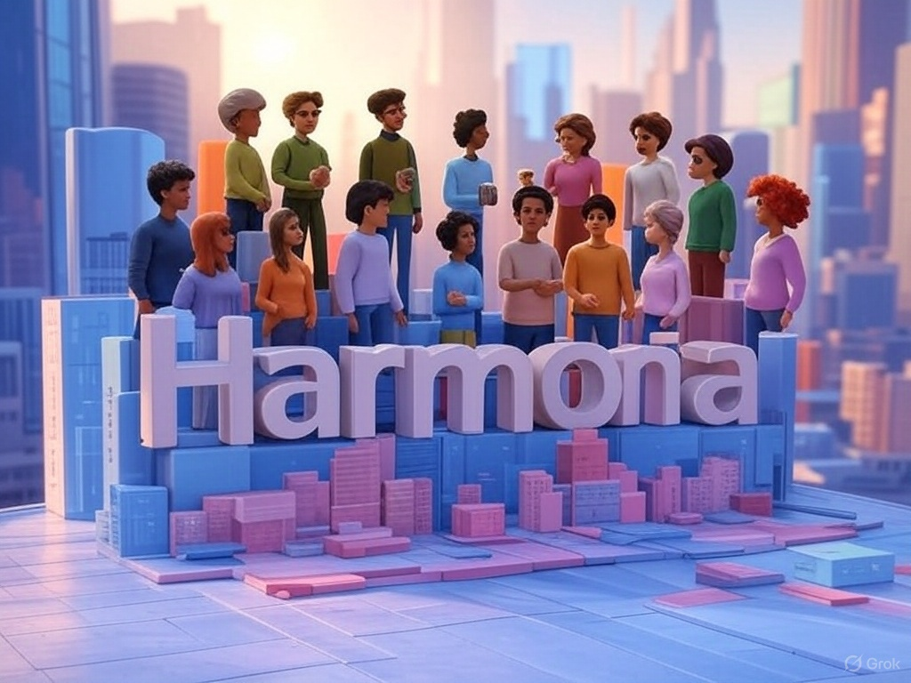

# HARMONIA
## Um Mundo Virtual de Conexões Sociais em 3D



> 🌐 **Harmonia** é um mundo virtual 3D em estilo voxel onde jogadores exploram um ambiente compartilhado e encontram outros com visões de mundo semelhantes. Os avatares refletem visualmente suas identidades culturais, políticas e pessoais através de um sistema de representação visual sutil e não-estereotipado.

---

## 📋 Índice

- [Visão Geral](#visão-geral)
- [Características Principais](#características-principais)
- [Tecnologias Utilizadas](#tecnologias-utilizadas)
- [Estado Atual da Implementação](#estado-atual-da-implementação)
- [Instalação e Execução](#instalação-e-execução)
- [Estrutura do Projeto](#estrutura-do-projeto)
- [Configuração do Ambiente](#configuração-do-ambiente)
- [Guia de Contribuição](#guia-de-contribuição)
- [Próximos Passos](#próximos-passos)
- [Licença](#licença)

---

## 🔍 Visão Geral

Harmonia é uma experiência social inovadora que combina elementos de redes sociais e mundos virtuais em um ambiente 3D interativo. Diferente de jogos tradicionais, Harmonia foca em criar conexões autênticas entre pessoas com visões de mundo semelhantes, utilizando representações visuais sutis e não-estereotipadas.

O projeto foi concebido como uma alternativa às redes sociais polarizadoras, criando um espaço para expressão autêntica e descoberta de pessoas com valores semelhantes, sem reforçar estereótipos ou alimentar animosidades.

---

## ✨ Características Principais

### 🧩 Perfil e Avatar
- **Questionário não-invasivo**: Perfil baseado em crenças, valores e identidade
- **Avatar customizado**: Representação visual que reflete sutilmente aspectos da personalidade
- **Sistema não-estereotipado**: Características visuais que evitam clichês e generalizações

### 🌍 Mundo Virtual 3D
- **Ágora Central**: Praça principal onde todos iniciam sua jornada
- **Distritos Temáticos**: Áreas especializadas como:
  - Distrito da Arte
  - Distrito da Filosofia
  - Distrito da Ciência
  - Jardins da Meditação
- **Ambiente Dinâmico**: Iluminação que muda ao longo do dia virtual

### 🤝 Interações Sociais
- **Sistema de "Ressonância"**: Efeito visual que indica compatibilidade entre jogadores
- **Gestos Sociais**: Acenar, cumprimentar, observar e desviar
- **Chat de Texto**: Comunicação escrita com tradução automática
- **Emotes**: Sistema expressivo de comunicação não-verbal

### 🔄 Sistema de Compatibilidade
- **Algoritmo Multi-dimensional**: Cálculo baseado em diversos aspectos do perfil
- **Visualização de Afinidade**: Auras e partículas que indicam nível de compatibilidade
- **Evolução Dinâmica**: Sistema que se adapta com base nas interações do usuário

### 👥 Conectividade
- **Encontros Casuais**: Sistema para facilitar interações entre pessoas compatíveis
- **Sistema de Amizades**: Criação de "conexões" após interações positivas
- **Círculos Sociais**: Grupos de pessoas com interesses comuns

---

## 💻 Tecnologias Utilizadas

### Frontend
- **Three.js**: Renderização 3D do mundo virtual
- **HTML5 & CSS3**: Interface de usuário responsiva
- **JavaScript**: Lógica de jogo no cliente

### Backend
- **Node.js**: Servidor em tempo real
- **Socket.IO**: Comunicação bidirecional cliente-servidor
- **Express**: Servidor web para servir os assets e o cliente

### Otimizações
- **Spatial Hash Grid**: Sistema para otimizar atualizações de rede
- **Level of Detail (LOD)**: Renderização adaptativa baseada na distância
- **Comunicação Seletiva**: Envio de dados apenas para jogadores próximos

---

## 🚀 Estado Atual da Implementação

O projeto Harmonia atualmente possui os seguintes componentes implementados:

### Estrutura Básica
- ✅ Servidor Node.js com Socket.IO
- ✅ Cliente Three.js com renderização 3D
- ✅ Sistema de controles FPS (teclado e touch)
- ✅ Avatar customizado baseado no perfil
- ✅ Interações básicas entre jogadores

### Recursos Avançados
- ✅ Sistema de compatibilidade com efeitos visuais
- ✅ Emotes e animações para comunicação não-verbal
- ✅ Chat de texto entre jogadores
- ✅ Otimizações de rede para múltiplos jogadores
- ✅ Detecção de colisão simples

### Em Desenvolvimento
- 🔄 Distritos temáticos completos
- 🔄 Sistema de amizades persistente
- 🔄 Eventos temporários
- 🔄 Otimizações para dispositivos móveis

---

## 📦 Instalação e Execução

### Pré-requisitos
- Node.js (versão 14.x ou superior)
- NPM (normalmente instalado com o Node.js)
- Navegador moderno com suporte a WebGL (Chrome, Firefox, Edge, Safari)

### Instalação

1. Clone o repositório:
```bash
git clone https://github.com/seu-usuario/harmonia-game.git
cd harmonia-game
```

2. Instale as dependências:
```bash
npm install
```

### Execução em Desenvolvimento

Para iniciar tanto o servidor quanto o cliente em modo de desenvolvimento:
```bash
npm run dev:all
```

Para iniciar apenas o servidor:
```bash
npm run dev
```

Para iniciar apenas o cliente:
```bash
npm run client
```

### Execução em Produção
```bash
npm start
```

### Acesso ao Jogo
- Em desenvolvimento: http://localhost:3000
- Cliente separado: http://localhost:8080

---

## 📁 Estrutura do Projeto

```
harmonia-game/
│
├── client/               # Frontend do jogo
│   ├── css/              # Estilos CSS
│   ├── js/               # Scripts do cliente
│   │   ├── avatar.js     # Renderização dos avatares
│   │   ├── controls.js   # Controles FPS e touch
│   │   ├── emote.js      # Sistema de expressões
│   │   ├── game.js       # Lógica principal do jogo
│   │   ├── network.js    # Comunicação com o servidor
│   │   ├── ui.js         # Interface do usuário
│   │   ├── utils.js      # Funções utilitárias
│   │   ├── compatibility.js # Sistema de compatibilidade
│   │   └── world.js      # Ambiente 3D
│   └── index.html        # Página principal
│
├── server/               # Backend do jogo
│   └── index.js          # Servidor Node.js com Socket.IO
│
├── assets/               # Recursos do jogo
│   ├── textures/         # Texturas para o mundo e avatares
│   ├── sounds/           # Efeitos sonoros e música
│   └── models/           # Modelos 3D
│
├── common/               # Código compartilhado entre cliente e servidor
│
├── docs/                 # Documentação
│   ├── harmonia-game-concept.md  # Conceito do jogo
│   ├── implementation-summary.md # Resumo da implementação
│   ├── next-steps.md     # Próximos passos
│   └── setup-instructions.md # Instruções de configuração
│
├── .gitignore            # Configuração de arquivos ignorados pelo Git
├── package.json          # Configuração NPM e scripts
└── README.md             # Este arquivo
```

---

## ⚙️ Configuração do Ambiente

### Variáveis de Ambiente

Crie um arquivo `.env` na raiz do projeto com as seguintes configurações:

```
PORT=3000
CLIENT_PORT=8080
NODE_ENV=development
```

### Configuração para Produção

Para implantação em produção, recomenda-se:

1. Configurar um servidor proxy reverso (Nginx ou Apache)
2. Utilizar PM2 para gerenciamento de processos
3. Configurar SSL para comunicação segura

Exemplo de configuração com PM2:
```bash
npm install -g pm2
pm2 start server/index.js --name "harmonia" -- --prod
```

---

## 🤝 Guia de Contribuição

Contribuições são bem-vindas! Se você deseja contribuir com o projeto Harmonia, siga estas etapas:

1. Faça um fork do repositório
2. Crie uma branch para sua feature (`git checkout -b feature/nome-da-feature`)
3. Faça commit das suas mudanças (`git commit -m 'Adiciona nova feature'`)
4. Faça push para a branch (`git push origin feature/nome-da-feature`)
5. Abra um Pull Request

### Diretrizes de Código
- Siga o estilo de código existente
- Escreva testes para novas funcionalidades
- Mantenha a documentação atualizada
- Otimize para performance, especialmente em dispositivos móveis

---

## 📈 Próximos Passos

O desenvolvimento futuro do Harmonia está planejado nas seguintes áreas:

### Melhorias Imediatas
- Sistema de perfil aprimorado com banco de dados
- Modelos voxel melhorados e texturas customizadas
- Iluminação dinâmica com ciclo de dia/noite

### Expansão de Mecânicas
- Implementação completa dos distritos temáticos
- Sistema de amizades persistente
- Atividades colaborativas entre jogadores

### Otimizações Técnicas
- Implementação completa do Spatial Hash Grid
- Otimização para dispositivos móveis
- Arquitetura de microserviços para escalabilidade

### Recursos Avançados
- Sistema de IA para NPCs reativos
- Geração procedural de ambientes
- Sistemas de eventos dinâmicos baseados nos usuários presentes

Para mais detalhes, consulte o arquivo [next-steps.md](docs/next-steps.md).

---

## 📜 Licença

© 2025 - Todos os direitos reservados

Este projeto é licenciado sob a licença [MIT](LICENSE).

---

## 💌 Contato

Para dúvidas, sugestões ou colaborações, entre em contato através de:

- Email: [contato@harmonia-game.com](mailto:contato@harmonia-game.com)
- Website: [www.harmonia-game.com](https://www.harmonia-game.com)
- Discord: [Servidor Harmonia](https://discord.gg/harmonia)

---

<p align="center">
  <i>Harmonia - Conectando pessoas através de valores compartilhados</i>
</p>
